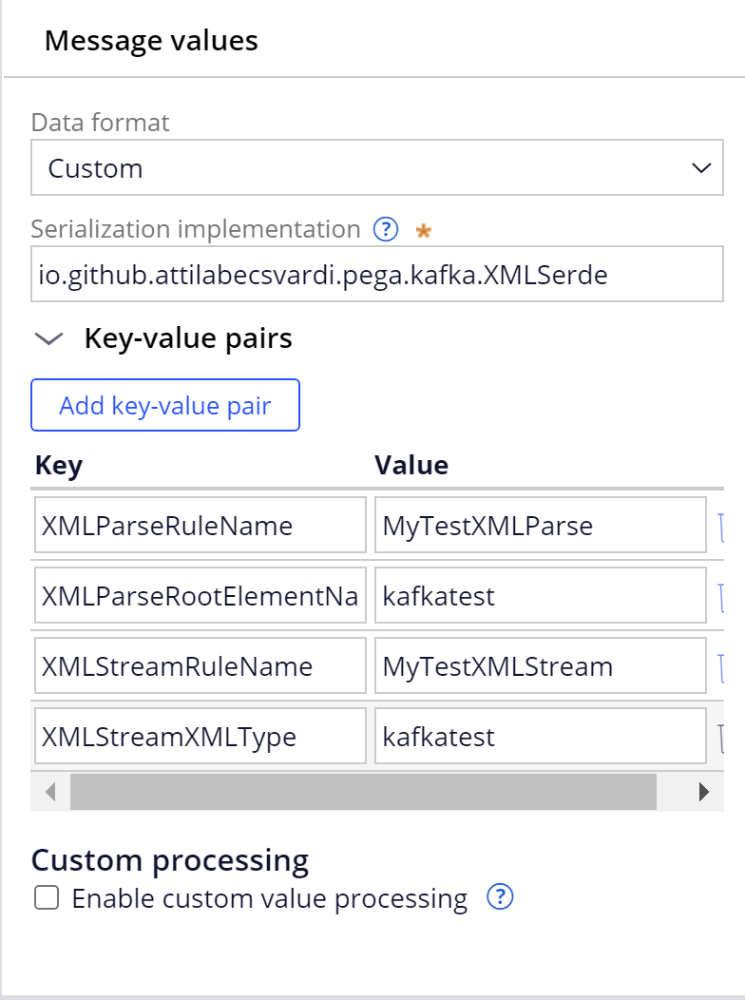

# pega-XMLSerde-for-Kafka

## Overview

This component provides XML data format support for Kafka dataset.

Main features:

* Serialization from Clipboard page to XML based on a Pega Stream-XML rule
* Deserialization from XML to Clipboard page based on a Pega Parse-XML rule

## Supported platform versions

The component has been tested with the following platform versions:

* Pega platform 8.7.x

## Building from source

Prerequisites:

1. Java (JDK) 8 or later.
3. Internet access
4. Git client
5. Access to Pega core Build Distribution Image ([more details](https://support.pega.com/discussion/where-can-i-fing-prpublicjar-file-server?))

Steps:
1. Extract **coreBuildDistributionImage.zip/archives/pegadbinstall-classes.zip** to a temporary folder
2. Copy the following jar files to the **libs** folder:
   1. pegadbinstall-classes/lib/pega/prpublic.jar → libs/prpublic.jar
   2. pegadbinstall-classes/lib/pega/printegrint.jar → libs/printegrint.jar
   3. pegadbinstall-classes/lib/pega/guava-19.0.jar → libs/guava-19.0.jar
   4. pegadbinstall-classes/lib/pega/prcommons-lang.jar → libs/prcommons-lang.jar

Build

```
git clone https://github.com/AttilaBecsvardi/pega-XMLSerde-for-Kafka pega-XMLSerde-for-Kafka
cd pega-XMLSerde-for-Kafka
mkdir bin
javac -proc:none -target 1.8 -d bin -cp ../../libs/commons-lang-2.6.jar:../../libs/guava-19.0.jar:../../libs/printegrint.jar:../../lib/prpublic.jar src/io/github/attilabecsvardi/pega/kafka/XMLSerde.java
mkdir jar
jar cfm jar/MyXMLSerde.jar src/META-INF/MANIFEST.MF -C bin .
```

The `MyXMLSerde.jar` are located in the `jar` folder.

## Download

You can also download prebuilt binaries directly
from [GitHub releases](https://github.com/AttilaBecsvardi/pega-XMLSerde-for-Kafka/releases).

## Installation

### Prerequisites

1. [Build](#building-from-source) or [download](https://github.com/AttilaBecsvardi/pega-XMLSerde-for-Kafka/releases) `MyXMLSerde.jar`

### Installing MyXMLSerde.jar file

1. Log in to your target Pega Platform (`https://<hostname>:<port>/prweb`) by entering your administrator ID  and password
2. In the header of Dev Studio, click **Configure -> Application -> Distribution -> Import**
3. Select the `MyXMLSerde.jar` file from your hard drive, and then follow the wizard instructions
4. When the import is complete, click **Done**
5. Restart your Pega environment

## How to use it

### Configuration
1. Log in to DevStudio
2. Create a regular data set of type Kafka
3. Configure the **Message Format** section to use the Custom message format
4. Specify the fully qualified classname of XMLSerde class, enter `io.github.attilabecsvardi.pega.kafka.XMLSerde`
5. Specify additional configuration options to be passed to XMLSerde configure method, it requires the following parameters:
- `XMLParseRuleName`: the name of your Pega Parse-XML rule to parse the XML message from Kafka dataset, used in deserialization
- `XMLParseRootElementName`: the second part of the name of your Pega Parse-XML rule
- `XMLStreamRuleName`: the name of your Pega Stream-XML rule to stream the Clipboard page to Kafka dataset, used in serialization
- `XMLStreamXMLType`: the second part of the name of your Pega Stream-XML rule
  

## Test
TBD

## Known issues
* Parse-XML rule issue: The unit tests were successful, but when attempting to use the custom dataset in a data flow, the system was unable to execute the Parse-XML rule. It appears to be related to an old error with the XML parser. To fix the issue, you need to enable the old assembler by using the Pega-IntegrationEngine•SwitchToOldAssembler dynamic system setting (DSS).

## References

- [Kafka custom serializer/deserializer implementation](https://support.pega.com/discussion/kafka-custom-serializerdeserializer-implementation)
