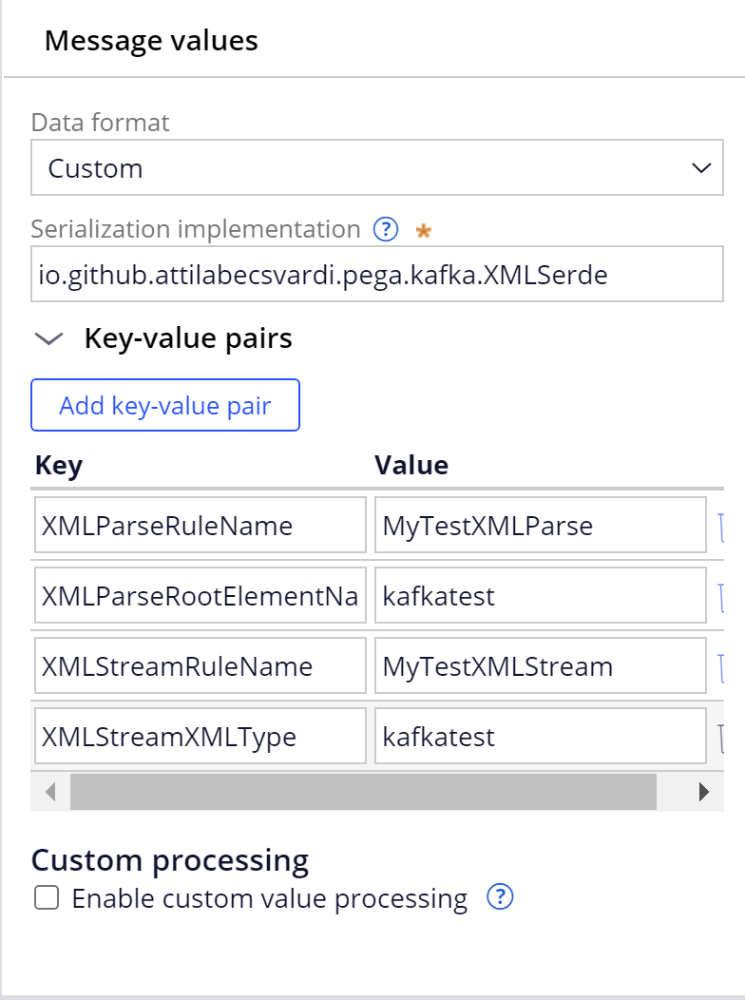

# pega-XMLSerde-for-Kafka

## Overview

This component provides XML data format support for Kafka dataset.

Main features:

* Serialization from Clipboard page to XML based on a Pega Stream-XML rule
* Deserialization from XML to Clipboard page based on a Pega Parse-XML rule

## Supported platform versions

The component has been tested with the following platform versions:

* Pega platform 8.7.x

## Building from source

Prerequisites:

1. Java (JDK) 8 or later.
2. Apache Maven 3.6+
3. Internet access
4. Git client

In order to build the component from source, you need to have access to **coreBuildDistributionImage** and have **Gradle 4.8** or higher.

1. Extract **coreBuildDistributionImage.zip/archives/pegadbinstall-classes.zip** to a temporary folder
2. Extract **coreBuildDistributionImage.zip/archives/prweb.war** to a temporary folder
3. Copy the following jar files to the **libs** folder:
   1. pegadbinstall-classes/lib/pega/prpublic.jar → libs/prpublic.jar
   2. pegadbinstall-classes/lib/pega/prprivate.jar → libs/prprivate.jar
   3. pegadbinstall-classes/lib/pega/prprivcommon.jar → libs/prprivcommon.jar
   4. pegadbinstall-classes/lib/pega/printegrext.jar → libs/printegrext.jar
   5. pegadbinstall-classes/lib/pega/printegrint.jar → libs/printegrint.jar
   6. pegadbinstall-classes/lib/pega/prenginext.jar → libs/prenginext.jar
   7. pegadbinstall-classes/lib/pega/prcommons-lang.jar → libs/prcommons-lang.jar
   8. pegadbinstall-classes/lib/pega/pricu2jdk.jar → libs/pricu2jdk.jar
   9. pegadbinstall-classes/lib/pega/d-node-x.y.x.jar → libs/d-node.jar
   10. prweb.war/WEB-INF/lib/prbootstrap-x.y.x.jar → libs/prbootstrap.jar
   11. prweb.war/WEB-INF/lib/prbootstrap-api-x.y.x.jar → libs/prbootstrap-api.jar
4. Run `./gradlew createWrapperJar` to generate **build/libs/schema-registry-integration-1.0.0.jar** component jar, which can be installed as a component

Build

```
git clone https://github.com/AttilaBecsvardi/pega-jdbc-driver pega-jdbc-driver
cd pega-jdbc-driver
mvn package
```

Binaries are in `target` folder. You will need the Uber JAR, it's called `MyXMLSerde.jar`.

## Download

You can also download prebuilt binaries directly
from [GitHub releases](https://github.com/AttilaBecsvardi/pega-XMLSerde-for-Kafka/releases).

## Installation

### Prerequisites

1. [Build](#Build) or [download](https://github.com/AttilaBecsvardi/pega-XMLSerde-for-Kafka/releases) `MyXMLSerde.jar`

### Installing MyXMLSerde.jar file

1. Log in to your target Pega Platform (`https://<hostname>:<port>/prweb`) by entering your administrator ID  and password
2. In the header of Dev Studio, click **Configure -> Application -> Distribution -> Import**
3. Select the `MyXMLSerde.jar` file from your hard drive, and then follow the wizard instructions
4. When the import is complete, click **Done**
5. Restart your Pega environment

## How to use it

### Configuration
1. Log in to DevStudio
2. Create a regular data set of type Kafka
3. Configure the `Message Format` section to use the Custom message format
4. Specify the fully qualified classname of XMLSerde class, enter `io.github.attilabecsvardi.pega.kafka.XMLSerde`
5. Specify additional configuration options to be passed to XMLSerde configure method, it requires the following parameters:
  - `XMLParseRuleName`: the name of your Pega Parse-XML rule to parse the XML message from Kafka dataset, used in deserialization
  - `XMLParseRootElementName`: the second part of the name of your Pega Parse-XML rule
  - `XMLStreamRuleName`: the name of your Pega Stream-XML rule to stream the Clipboard page to Kafka dataset, used in serialization
  - `XMLStreamXMLType`: the second part of the name of your Pega Stream-XML rule


##Test


## References

- [Kafka custom serializer/deserializer implementation](https://support.pega.com/discussion/kafka-custom-serializerdeserializer-implementation)
